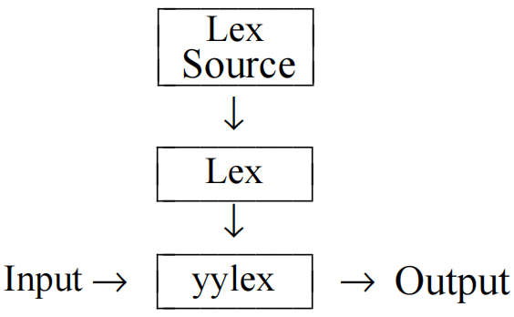
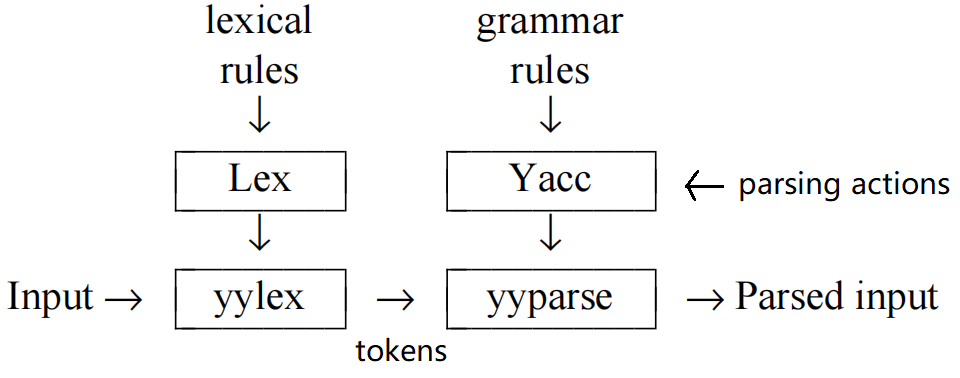

# lab2: 词法分析+语法分析+语法动作（C语言）

# Lex

## Why

- 如何实现词法分析？
  - 用正则表达式（REG）的形式语言来指明词法单词
  - 用确定的有限自动机（DFA）来实现词法分析器（REG与DFA等价）
- 构造DFA是一种机械性的工作，很容易由计算机来实现。因此，一种有意义的做法是，用词法分析器的自动生成器（Lex）来将REG转换为DFA

## What



- **Lex source** is a table of **regular expressions** and corresponding **program fragments**.
- **Lex** is a **program generator** designed for lexical processing of character input streams.
- **yylex** is the name of the **generated program** (DFA, O(n)).
  - It reads an input stream, copying it to an output stream and partitioning the input into strings which match the given regular expressions.
  - As each such string is recognized, the corresponding program fragment is executed.

## How

- The general form of a Lex source file is:

  ```lex
  声明部分 (declarations)
  %%
  规则部分 (rules)
  %%
  辅助函数 (programs)
  ```
- 声明部分

  - Included code（token一般是yacc中%token定义的）

    ```lex
    %{
    /* 头文件 */
    ...
    "parser.h" // yacc生成的头文件必须放在最后
    /* 自定义函数与变量 */
    int c;
    ...
    %}
    ```
  - Start conditions

    ```lex
    %s COMMENT1 COMMENT2
    ```
  - Definitions (regexp nicknames)

    ```lex
    punctuation [()\[\]{}=,;.!]
    integer   [1-9][0-9]*|0
    id      [a-z_A-Z][a-z_A-Z0-9]*
    ```
- 规则部分

  - Regular expressions in Lex use the following operators (x is a char, s=xyz… is a string)

    | sign   | meaning                                             |
    | ------ | --------------------------------------------------- |
    | x      | the character "x"                                   |
    | "s"    | a "s", even if x in s is an operator.               |
    | \x     | an "x", even if x is an operator.                   |
    | [xy]   | the character x or y.                               |
    | [x−z] | the characters x, y or z.                           |
    | [ˆs]  | any character but characters in s.                  |
    | .      | any character but newline.                          |
    | ˆs    | s at the beginning of a line.                       |
    | \<y\>s | an s when Lex is in start condition y.              |
    | s$     | an s at the end of a line.                          |
    | x?     | an optional x.                                      |
    | x∗    | 0,1,2, ... instances of x.                          |
    | x+     | 1,2,3, ... instances of x.                          |
    | x\|y   | an x or a y.                                        |
    | (x)    | an x.                                               |
    | x/y    | an x but only if followed by y.                     |
    | {xx}   | the translation of xx from the definitions section. |
    | x{m,n} | m through n occurrences of x                        |
  - 最长匹配、规则优先（同长度的情况下）：When more than one expression can match the current input, Lex chooses as follows:

    - 1) The longest match is preferred.
    - 2) Among rules which matched the same number of characters, the rule given first is preferred.
  - Lines in the rules section have the form `expression action` where the action may be continued on succeeding lines by using braces to delimit it.

    - 正则表达式（expression）前：加\<x\>则仅在状态x匹配reg，不加\<x\>则在所有状态匹配reg，通过BEGIN x进行状态切换；词法规范应当是完整的，它应当总是能与输入中的某些初始子串相匹配，因此在rules最后需要有一条统配"."用来错误处理（比如printf("Illegal input \"%c\"\n", yytext[0]);）
    - 代码块（action）中：return的token一般是yacc中%token定义的（比如PUTCH）；yylval的内容一般是yacc中%union定义的（比如yylval.pos）；常用yytext表示匹配的reg，yyleng表示其长度
  - 例如

    ```lex
    %%
    <INITIAL>"//" {BEGIN COMMENT1;}
    <INITIAL>"/*" {BEGIN COMMENT2;}
    …
    <INITIAL>"putch" {
      yylval.pos = A_Pos(line, pos);
      pos += yyleng;
      return PUTCH;
    }
    …
    <INITIAL>{id} {
      yylval.exp = A_IdExp(A_Pos(line, pos), String(yytext));
      pos += yyleng;
      return ID;
    }
    …
    <INITIAL>. {
      printf("Illegal input \"%c\"\n", yytext[0]);
    }

    <COMMENT1>\n {BEGIN INITIAL;}
    <COMMENT1>. {}
    …
    %%
    ```

# Yacc

## Why

- 如何实现语法分析与语法动作？
  - 用上下文无关语法（CFG）来指明语法规则
  - 用语法分析算法来实现语法分析器
- 用语法分析器的自动生成器来将语法规则转换为语法分析表并执行相应的动作的程序很方便

## What



- Yacc是语法分析器（语法分析+语法动作）的自动生成器；它主要针对LR(1)语法，因为编程语言几乎都能用LR(1)语法表示；它使用构造LALR(1)表的方法，因为存储空间相对较小；它通过声明优先级可以解决冲突问题，因此不仅可以处理LR(1)语法，还能处理有歧义的语法，非常强大。
- Yacc generates a function (the parser) to control the input process.
- The parser calls the user-supplied low-level input routine (the lexical analyzer) to pick up the basic items (called tokens) from the input stream.
- These tokens are organized according to the input structure rules (the grammar rules) ; when one of these rules has been recognized, then user code supplied for this rule (the parsing action) is invoked; actions have the ability to return values and make use of the values of other actions. 可见，Yacc包含Parse和Parsing Actions两部分！

## How

- The general form of a Yacc source file is: （和Lex相同）

  ```yacc
  声明部分 (declarations)
  %%
  规则部分 (rules)
  %%
  辅助函数 (programs)
  ```
- 声明部分

  - Included code

    ```yacc
    %{
    /* 头文件 */
    #include ...
    /* lex函数与变量 */
    extern int yylex();
    extern void yyerror(char*);
    extern int  yywrap();
    /* 自定义函数与变量 */
    extern A_prog root;
    %}
    ```
  - yylval：%token和%type的\<xxx\>中的xxx，必须是%union中定义的变量名，即语义值类型

    ```yacc
    %union {
      A_pos pos;
      A_type type;
      ...
    }
    ```
  - termianl symbols

    ```yacc
    %token<pos> IF ELSE
    ...
    ```
  - non-termianl symbols

    ```yacc
    %type<prog> PROG
    ...
    ```
  - start symbol：只有1个，可以是上面%token, %type没定义的，也可以是定义过的

    ```yacc
    %start PROG
    ```
  - precedence：%left或%right或%noassoc后跟着的标识，可以是上面%token, %type没定义的，也可以是定义过的

    ```yacc
    %left IF
    %left ELSE
    %right '='
    %left OR
    %left AND
    %left EQ NE
    %left LT LE GT GE
    %left ADD MINUS
    %left TIMES DIV
    %right '!' UMINUS
    %left '.' '(' ')' '[' ']'
    ```

    - 虽然默认情况下，Yacc选择移进来解决移进-归约冲突，选择使用在语法中先出现的规则来解决归约一归约冲突。但是我们必须声明优先级完全消除冲突！必要的时候在规则后加上%prec（比如IF … ELSE …）
- 规则部分

  - 产生式之间用";"隔开；每个产生式的形式为 A: α {…} | β {…} | …;，表示规则 A -> α | β | …及其对应的动作，每当用一条规则进行归约时便执行对应的语义动作代码；如果规则为空，则不写产生式（见VARDECLLIST/* empty */）
  - 每条规则的动作（{…}部分）都要有返回值，形式是 $$ = …；如果要调用生成式A -> α中右部符号的返回值，从左到右用$1, $2, …引用，其含义是对应符号的%token或%type定义中\<xxx\>里%union对应的xxx；根PROG中的动作一定要给root赋值
  - 例如

    ```yacc
    %%

    PROG: MAINMETHOD CLASSDECLLIST {
      root = A_Prog(A_Pos($1->pos->line, $1->pos->pos), $1, $2);
      $$ = root;
    } ;

    MAINMETHOD: PUBLIC INT MAIN '(' ')' '{' VARDECLLIST STMLIST '}' {
      $$ = A_MainMethod($1, $7, $8);
    } ;

    VARDECLLIST: /* empty */ {
      $$ = NULL;
    } | VARDECL VARDECLLIST {
      $$ = A_VarDeclList($1, $2);
    } ;

    ...

    STM: ...
    } | IF '(' EXP ')' STM ELSE STM {
      $$ = A_IfStm($1, $3, $5, $7);
    } | IF '(' EXP ')' STM %prec IF {
      $$ = A_IfStm($1, $3, $5, NULL);
    } ...

    ...

    EXP: ... 
    } | MINUS EXP %prec UMINUS {
      $$ = A_MinusExp($1, $2);
    } ...

    ...
    ```
- 辅助函数

  ```yacc
  void yyerror(char *s) {
    fprintf(stderr, "%s\n",s);
  }

  int yywrap() {
    return(1);
  }
  ```
- main函数中如何调用yacc

  ```c
  ...
  #include "frontend/parser.h" // yacc generated. must put last!

  A_prog root;

  extern int yyparse();

  int main(int argc, const char * argv[]) {
    yyparse();
    ...
  	return 0;
  }
  ```

# Lex+Yacc

## 模板

- Lex

  ```lex
  /* 1. declarations */

  /* included code */
  %{

  #include "parser.h"

  %}

  /* start conditions */

  /* regexp nicknames */

  %% /* 2. rules */

  %% /* 3. programs */
  ```
- Yacc

  ```yacc
  /* 1. declarations */

  /* included code */
  %{

  #include <stdio.h>

  extern int yylex();
  extern void yyerror(char*);
  extern int  yywrap();

  %}

  /* yylval */

  /* termianl symbols */

  /* non-termianl symbols */

  /* start symbol */

  /* precedence */

  %% /* 2. rules */

  %% /* 3. programs */

  void yyerror(char *s) {
    fprintf(stderr, "%s\n",s);
  }

  int yywrap() {
    return(1);
  }
  ```

## 顺序

1. Yacc：根据AST，定义yylval
2. Yacc：根据语法，定义termianl symbols（tokens）、non-termianl symbols、start symbol
3. Lex：根据词法，编写词法解析规则，在代码部分将token的值填充进yylval，并将token返回给Yacc
4. Yacc：根据语法，定义precedence，编写语法解析规则，在代码部分生成AST


